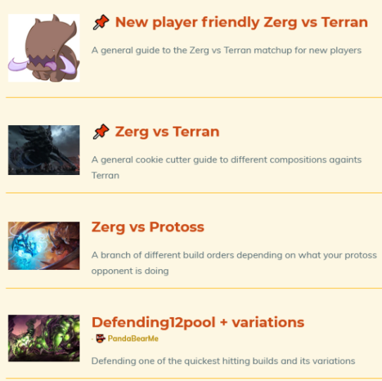
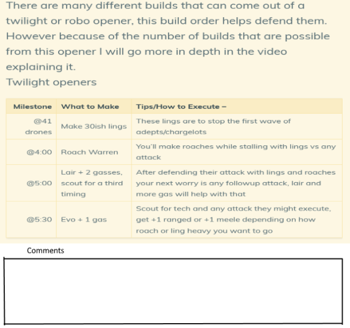

# Website: Egors Coaching and Zerg Guides Website (Working title: HiveMind)
DEPLOYED SITE: https://main--lustrous-kulfi-ced407.netlify.app/
SERVER: https://github.com/EGORDYU/project4-server
FRONTEND: https://github.com/EGORDYU/project4-frontend
## Technologies Used

    Django (Python web framework)
    React (JavaScript library for building user interfaces)
    PostgreSQL (Relational database management system)
    Django REST Framework (API framework for Django)
    React Router (Library for handling navigation in React)
    Axios (HTTP client for making API requests)
    JWT (JSON Web Tokens for authentication)
    MUI (Material UI CSS Framework)
    HTML/CSS (Frontend design and styling)
    Git (Version control)

## Description
The (DR stack) SC2 Coaching Website is a web application that provides StarCraft II coaching services. The application allows users to create an account, log in, and access various features such as leaving comments and viewing build orders, as well as eventually scheduling sessions with a calendar API.

The backend of the application is built using Django, a powerful Python web framework. Django provides a robust and scalable foundation for handling user authentication, managing the database, and serving API endpoints. PostgreSQL is used as the database management system to store user information, comments, and build orders.

The frontend of the application is built using React, a popular JavaScript library for building user interfaces. React Router is used for handling client-side routing, allowing seamless navigation between different pages of the application. Axios is used for making HTTP requests to the backend API, enabling data retrieval and manipulation.

## User Stories

As a user, I want to be able to create an account and log in to the website.
As a user, I want to be able to view a list of build orders for StarCraft II.
As a user, I want to be able to leave comments on build orders.
As a user, I want to be able to filter build orders based on specific criteria (e.g., race, difficulty).

## User Flow

The user visits the website and is presented with a login/signup page.
The user can create a new account or log in using existing credentials.
Upon successful authentication, the user is redirected to the build order page.
The user can browse through the list of available build orders.
The user can click on a build order to view more details and comments.
The user can leave comments on the build order page.
The user can schedule a session with a calendar API.
The user can log out to end the session.

| HTTP Method | Route                    | Description                              |
|-------------|--------------------------|------------------------------------------|
| GET         | /api/build-orders        | Fetch all build orders                    |
| GET         | /api/build-orders/:id    | Fetch a specific build order              |
| POST        | /api/build-orders        | Create a new build order                  |
| PUT         | /api/build-orders/:id    | Update a specific build order             |
| DELETE      | /api/build-orders/:id    | Delete a specific build order             |
| GET         | /api/comments            | Fetch all comments                        |
| GET         | /api/comments/:id        | Fetch a specific comment                  |
| POST        | /api/comments            | Create a new comment                      |
| PUT         | /api/comments/:id        | Update a specific comment                 |
| DELETE      | /api/comments/:id        | Delete a specific comment                 |
| POST        | /api/signup              | Register a new user                       |
| POST        | /api/login               | Authenticate user and retrieve JWT token  |
| POST        | /api/logout              | Logout and invalidate JWT token           |
| GET         | /api/sessions            | Fetch all scheduled sessions              |
| GET         | /api/sessions/:id        | Fetch a specific session                  |
| POST        | /api/sessions            | Schedule a new session                    |
| PUT         | /api/sessions/:id        | Update a specific session                 |
| DELETE      | /api/sessions/:id        | Delete a specific session                 |

Sprint 1:

Set up the Django backend with Django REST Framework.
Create the necessary models and database tables.
Implement basic API endpoints for build orders.

Sprint 2:

Set up the React frontend.
Create the build order listing page and display the list of build orders.
Implement user authentication functionality.

Sprint 3:

Allow users to view build order details and leave comments.
Implement filtering functionality for build orders.
Create the add/edit build order functionality.

Sprint 4:

Integrate session scheduling feature with a calendar API.
Enhance the user interface using a CSS framework (e.g., Material UI).
Implement responsive design for mobile-friendly layouts.
Perform testing and bug fixing.

## ERD

## MVP (Minimum Viable Product)
    User Authentication
    Build Orders
    User Interface
    Database
    API Endpoints
    Frontend-Backend Integration

## Strech goals
    Integrating Calendar API for Session Scheduling

### signup page

### coach sidebar

### posts

### comments under each post
